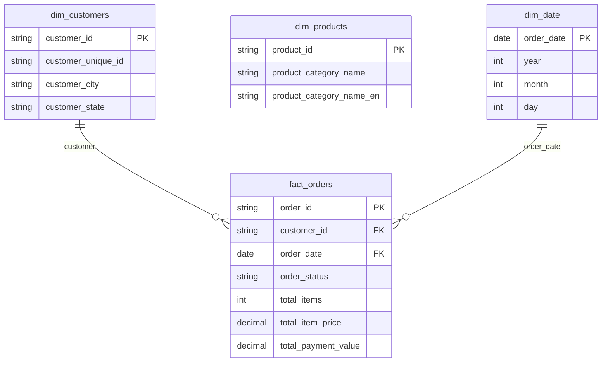
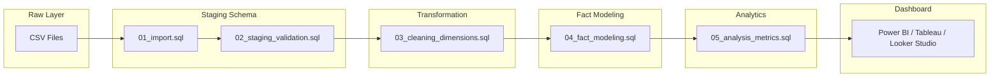

# E-Commerce Analytics (Brazilian Olist Dataset)


⸻

E-Commerce Analytics (Brazilian Olist Dataset)

SQL: PostgreSQL

Focus: Analytics Engineering (SQL + Dashboard)

Model: Star Schema (Fact & Dimension Tables)

⸻

Project Overview

This project builds an end-to-end SQL data pipeline to transform raw Brazilian e-commerce data into a structured analytical model for business decision-making.

It simulates a real-world analytics workflow, starting from raw data ingestion to a dashboard-ready data model.

Key capabilities demonstrated:

* Designing layered data architecture (staging → warehouse → analytics)
* Data validation and quality checks
* Building dimensional models (fact and dimension tables)
* Generating business-ready metrics using SQL

⸻

Business Impact

This project enables:

* Monitoring revenue performance over time
* Understanding customer purchasing behavior
* Identifying high-performing customers and trends
* Detecting potential revenue discrepancies
* Supporting data-driven decision making

The final dataset is designed to be directly connected to BI tools such as Power BI, Tableau, or Looker Studio.

⸻

Data Pipeline Overview

1. Import raw data
2. Store in staging layer
3. Validate and clean data
4. Transform into dimensional model
5. Generate business metrics
6. Connect to dashboard

⸻

Repository Structure

```
ecommerce-sql-analysis/
│
├── sql/
│   ├── 01_import.sql
│   ├── 02_staging_validation.sql
│   ├── 03_cleaning_dimensions.sql
│   ├── 04_fact_modeling.sql
│   └── 05_analysis_metrics.sql
│
├── diagrams/
│   ├── erd.png
│   └── pipeline_flowchart.png
│
├── dashboard/
│   ├── dashboard.pbix
│   └── dashboard_link.txt
│
├── images/
│   └── dashboard_preview.png
│
└── README.md
```

⸻

Data Architecture

Staging Layer (staging schema)

Raw data imported from CSV files.

Tables:

* customers_raw
* orders_raw
* order_items_raw
* payments_raw
* products_raw
* sellers_raw
* category_translation_raw

⸻

Data Warehouse Layer (public schema)

Cleaned and transformed analytical tables using dimensional modeling.

Tables:

* dim_customers
* dim_products
* dim_date
* fact_orders

⸻

Data Model

This project follows a star schema design:

* Fact Table:
    * fact_orders (one row per order)
* Dimension Tables:
    * dim_customers
    * dim_products
    * dim_date

This structure enables efficient analytical queries and dashboard integration.

⸻

## Entity Relationship Diagram (ERD)



⸻

## Data Pipeline Flow


This pipeline represents a structured analytics workflow, transforming raw transactional data into a dimensional model for business analysis and dashboarding.

Star Schema Model: fact_orders with dimension tables (dim_customers, dim_products)

⸻

SQL Pipeline (Execution Order)

01_import.sql

* Create database and schemas (staging, public)
* Import CSV files into staging tables

02_staging_validation.sql

* Validate raw data (NULL checks, duplicates, sanity checks)
* Ensure consistency before transformation

03_cleaning_dimensions.sql

* Clean and standardize fields (TRIM, LOWER, date casting)
* Build dimension tables:
    * dim_customers
    * dim_products
    * dim_date

04_fact_modeling.sql

* Aggregate order_items and payments
* Build fact table:
    * fact_orders (one row per order)

05_analysis_metrics.sql

* Generate KPIs:
    * Total revenue
    * Total orders
    * Average order value (AOV)
* Perform advanced analysis:
    * Monthly revenue trend
    * Customer ranking
    * Revenue growth (window function)

⸻

How to Run

1. Run 01_import.sql
2. Run 02_staging_validation.sql
3. Run 03_cleaning_dimensions.sql
4. Run 04_fact_modeling.sql
5. Run 05_analysis_metrics.sql
6. Connect public tables to a BI tool

⸻

Dashboard

Connect the public schema to:

* Power BI
* Tableau
* Looker Studio

(Optional) Add dashboard link here:
Dashboard Link: (coming soon)

⸻

Key Insights

* Revenue shows fluctuations with clear monthly trends
* A small group of customers contributes significantly to total revenue
* Order value and payment value discrepancies can indicate data issues
* Business performance can be monitored effectively using aggregated metrics

⸻

Highlights

* Built a structured SQL data pipeline from raw to analytics layer
* Applied data validation across staging and transformation stages
* Designed a star schema for scalable analytics
* Implemented window functions for advanced business insights

⸻

Tech Stack

* PostgreSQL
* SQL (Analytics Engineering)
* Data Modeling (Star Schema)
* Power BI / Tableau / Looker Studio

⸻

Author

Ahmad Iqbal Maulana

Aspiring Data Analyst

LinkedIn: https://www.linkedin.com/in/ahmad-iqbal-maulana-9669b8228

GitHub: https://github.com/yourvaiqbal
