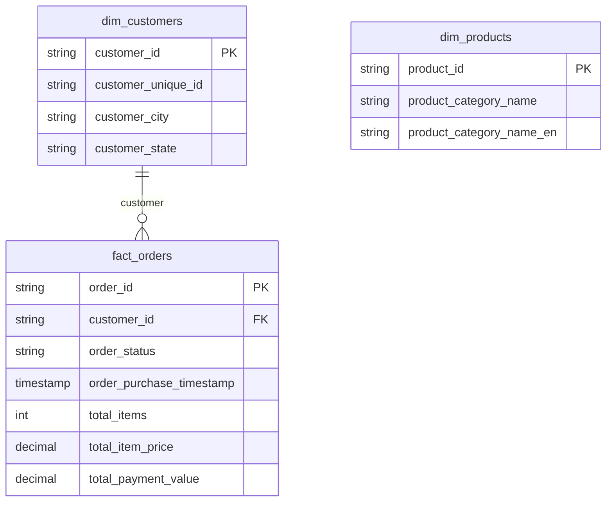
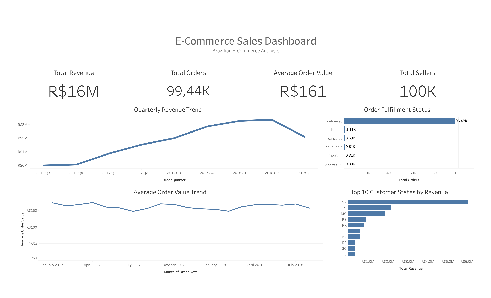

## E-Commerce Data Analysis (SQL End-to-End Project)


## Overview

This project is an end-to-end SQL data analytics project built using the Brazilian Olist E-Commerce Dataset covering transactions between 2016 and 2018. Focuses on transforming raw transactional e-commerce data into a structured analytical data model using PostgreSQL. The workflow includes raw data ingestion, data validation, dimensional modeling, fact table construction, business metric generation, and dashboard integration for business reporting.

Demonstrates practical skills commonly used in Data Analyst and Analytics Engineering roles, including:

* SQL data cleaning and transformation
* Data validation and quality checks
* Dimensional modeling
* Fact table construction
* Aggregation and KPI analysis
* Analytical query development
* Business performance analysis
* Dashboard-ready data preparation

The final analytical model is designed using a simplified star schema approach to support scalable reporting and dashboard visualization in BI tools such as Tableau.

---

## Business Insights

Key business insights identified from the analysis:

* Total revenue reached approximately R$16M during the analysis period.
* More than 95% of orders were successfully delivered, indicating strong operational fulfillment performance.
* Revenue growth accelerated significantly throughout 2017 and peaked during early-to-mid 2018.
* São Paulo (SP) generated the highest customer revenue contribution among all states.
* Average Order Value (AOV) remained relatively stable, indicating consistent customer purchasing behavior.
* Operational issues such as canceled and unavailable orders remained at low levels compared to completed deliveries.
* Quarterly revenue trends reveal strong marketplace expansion before experiencing a decline in late 2018.

These findings demonstrate how SQL-based analytical workflows can be used to generate actionable business insights from raw transactional datasets.

## Business Questions Answered

* Which states generated the highest revenue?
* How did revenue trend evolve between 2016 and 2018?
* What percentage of orders were successfully delivered?
* How stable was Average Order Value (AOV) over time?
* Which operational statuses contributed most to fulfillment issues?

--- 

## Tech Stack

- PostgreSQL
- SQL
- Tableau
- DBeaver
- GitHub

---


## Project Structure

```
ecommerce-sql-analysis/

  assets/
    e-commerce_sales.png

  dataset/
    category_translation.csv
    customer.csv
    order_items.csv
    orders.csv
    payments.csv
    products.csv
    sellers.csv

  sql/
    01_import.sql
    02_staging_validation.sql
    03_cleaning_dimensions.sql
    04_fact_modeling.sql
    05_analysis_metrics.sql

  README.md
```

---

## Data Pipeline

1. Import raw CSV data into staging schema
2. Validate data quality (NULL checks, duplicates, row counts)
3. Clean and standardize data
4. Build dimension tables
5. Aggregate transactional data
6. Build fact table at the order level
7. Generate analytical business metrics
8. Connect the final model to BI tools

## Data Architecture

Staging Layer (staging schema)

Raw transactional data imported without transformation.

Tables:

* customers_raw
* orders_raw
* order_items_raw
* payments_raw
* products_raw
* category_translation_raw

Purpose:

* Store raw imported data
* Perform validation before transformation
* Preserve original dataset integrity

---

Warehouse Layer (public schema)

Cleaned and modeled analytical tables.

Tables:

* dim_customers
* dim_products
* fact_orders

Purpose:

* Provide business-ready analytical tables
* Support dashboarding and reporting
* Enable scalable SQL analysis

---

## Data Model (Star Schema)

This project uses a simplified star schema design.

Fact Table

* fact_orders
    * One row represents one order

Dimension Tables

* dim_customers
* dim_products

Modeling Principle

The fact table is intentionally built at the order level using pre-aggregated transactional data.

This prevents double counting issues commonly caused by joining multiple transactional tables directly.

Note:
dim_products is prepared for future product-level analysis but is not directly joined to fact_orders because the current model focuses on order-level aggregation.

---

## Entity Relationship Diagram (ERD)



---

## Data Pipeline Flow


---

## Dashboard Preview



---

## SQL Pipeline (Execution Order)

1. Import raw CSV data
2. Clean staging tables
3. Build dimension tables
4. Create fact table
5. Generate business metrics
6. Visualize in Tableau

---

## Data Validation

Validation results:

* No NULL order_id
* No duplicate order_id
* Final fact table row count matches expected order count

```
SELECT COUNT(*) 
FROM public.fact_orders;

-- Result: 99,441 rows
```

## Analytical Findings

* Successfully transformed raw transactional data into a dashboard-ready analytical warehouse.
* Built a fact table containing 99,441 validated order-level records.
* Implemented aggregation strategies to avoid double-counting issues during transactional joins.
* Created reusable analytical structures for KPI reporting and BI visualization.
* Developed business-focused metrics including revenue trends, order fulfillment analysis, customer geographic performance, and average order value trends.
  
---

## Key Learnings

* Data validation is critical before transformation
* Aggregation should occur before joining transactional tables
* Improper joins can create double counting issues
* Star schema design improves analytical scalability
* SQL can be used to build complete analytical pipelines

---
## Dashboard & Reporting

The final analytical model was connected to Tableau to create an interactive business dashboard featuring:

* Revenue KPI tracking
* Order volume monitoring
* Average Order Value (AOV) analysis
* Seller activity overview
* Revenue trend analysis
* Order fulfillment status analysis
* Customer geographic revenue distribution

The dashboard was designed to simulate a real-world executive business reporting environment commonly used in e-commerce analytics.

---

## Author

Ahmad Iqbal Maulana — Data Analyst

LinkedIn:  
https://www.linkedin.com/in/ahmad-iqbal-maulana-9669b8228  

---

## Notes

Dataset: Brazilian E-Commerce Public Dataset by Olist  
Source: https://www.kaggle.com/datasets/olistbr/brazilian-ecommerce

---
