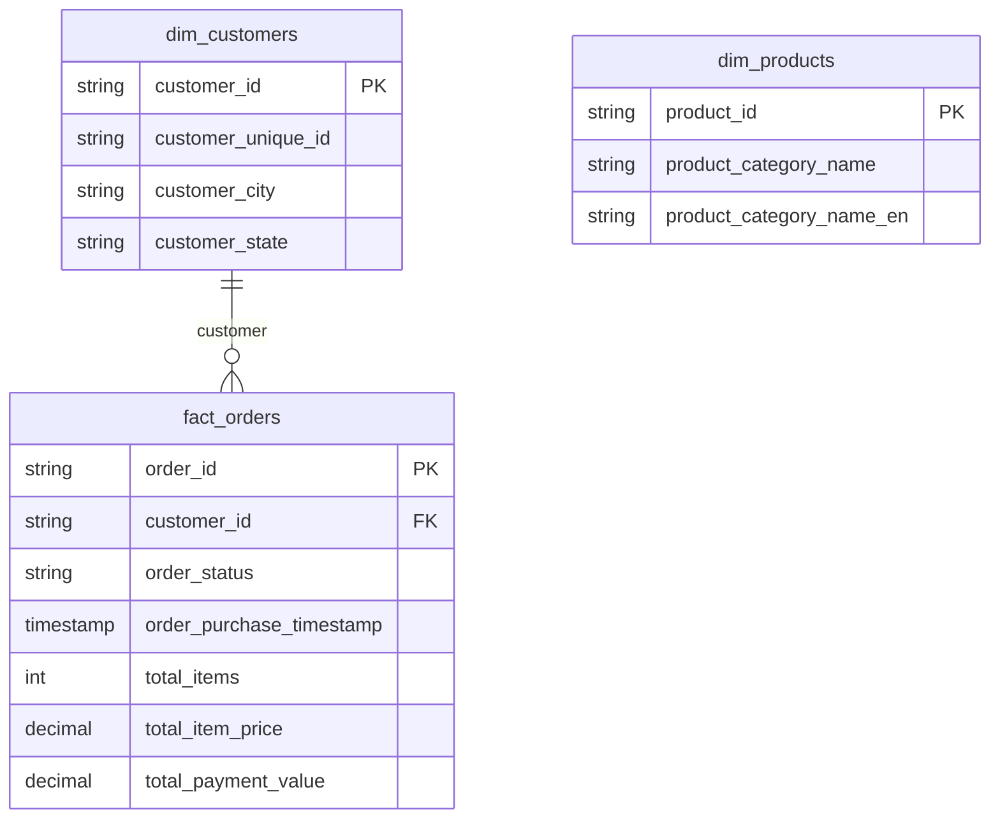
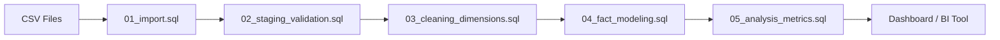

# E-Commerce Data Analysis (SQL End-to-End Project)

## Overview
This project demonstrates an end-to-end data pipeline using PostgreSQL to analyze e-commerce performance.

The workflow transforms raw transactional data into a structured analytical model (star schema), enabling business insights and dashboard integration.

---

## Tech Stack
- PostgreSQL
- SQL (Data Cleaning, Aggregation, Modeling)
- DBeaver
- GitHub

---

## Project Structure

```ecommerce-sql-analysis/
  sql/
    01_import.sql
    02_staging_validation.sql
    03_cleaning_dimensions.sql
    04_fact_modeling.sql
    05_analysis_metrics.sql
  assets/
    erd.png
    pipeline_flowchart.png
    dashboard_preview.png
  README.md
```
---

## Data Pipeline

1. Import raw data (CSV → staging schema)
2. Validate data quality (NULL, duplicates, row counts)
3. Clean and deduplicate data
4. Build dimension tables
5. Aggregate transactional data
6. Build fact table (order-level)
7. Generate analytical metrics
8. Connect to BI tools

---

## Data Architecture

### Staging Layer (staging schema)
Raw data imported without transformation:

- customers_raw
- orders_raw
- order_items_raw
- payments_raw
- products_raw
- category_translation_raw

---

### Warehouse Layer (public schema)

Cleaned and modeled tables:

- dim_customers
- dim_products
- fact_orders

---

## Data Model (Star Schema)

- fact_orders (1 row = 1 order)
- dim_customers
- dim_products

Note:
dim_products is prepared for future product-level analysis but is not directly joined to fact_orders due to aggregation at the order level.

---

## Entity Relationship Diagram (ERD)


---

## Data Pipeline Flow


---

## SQL Pipeline (Execution Order)

1. 01_import.sql  
   - Load raw data into staging schema  

2. 02_staging_validation.sql  
   - Validate NULL values  
   - Check duplicates  
   - Verify row counts  

3. 03_cleaning_dimensions.sql  
   - Deduplicate using ROW_NUMBER()  
   - Build dim_customers and dim_products  

4. 04_fact_modeling.sql  
   - Aggregate order_items and payments  
   - Build fact_orders  

   Key principle:
   The fact table is built at the order level (one row per order), with pre-aggregated metrics to prevent double counting.

5. 05_analysis_metrics.sql  
   - Revenue trend  
   - Order distribution  
   - Customer ranking  
   - AOV calculation  

---

## Data Validation

- No NULL order_id in staging
- No duplicate order_id
- Final row count:

SELECT COUNT(*) FROM public.fact_orders;
-- 99,441 rows

---

## Key Insights

- Revenue shows clear growth trend over time
- ~97% of orders are successfully delivered
- Small percentage of orders are canceled or unavailable
- Differences between item price and payment value indicate discounts or additional fees
- A small group of customers contributes significantly to total revenue

---

## How to Run

1. Load dataset into PostgreSQL (via DBeaver)

2. Run SQL files in order:

01_import.sql  
02_staging_validation.sql  
03_cleaning_dimensions.sql  
04_fact_modeling.sql  
05_analysis_metrics.sql  

---

## Sample Output (Recommended)

Add screenshot:

assets/revenue_trend.png

---

## Key Learnings

- Data cleaning is critical before modeling
- Aggregation must be done before joining transactional tables
- Poor joins can lead to double counting
- Star schema improves analytical performance
- SQL can be used to build full data pipelines

---

## Author

Ahmad Iqbal Maulana  
Aspiring Data Analyst  

LinkedIn: https://www.linkedin.com/in/ahmad-iqbal-maulana-9669b8228  
GitHub: https://github.com/yourvaiqbal  

---

## Notes

Dataset: Brazilian E-Commerce Public Dataset (Olist)

This project is part of a portfolio for entry-level data analyst roles.
