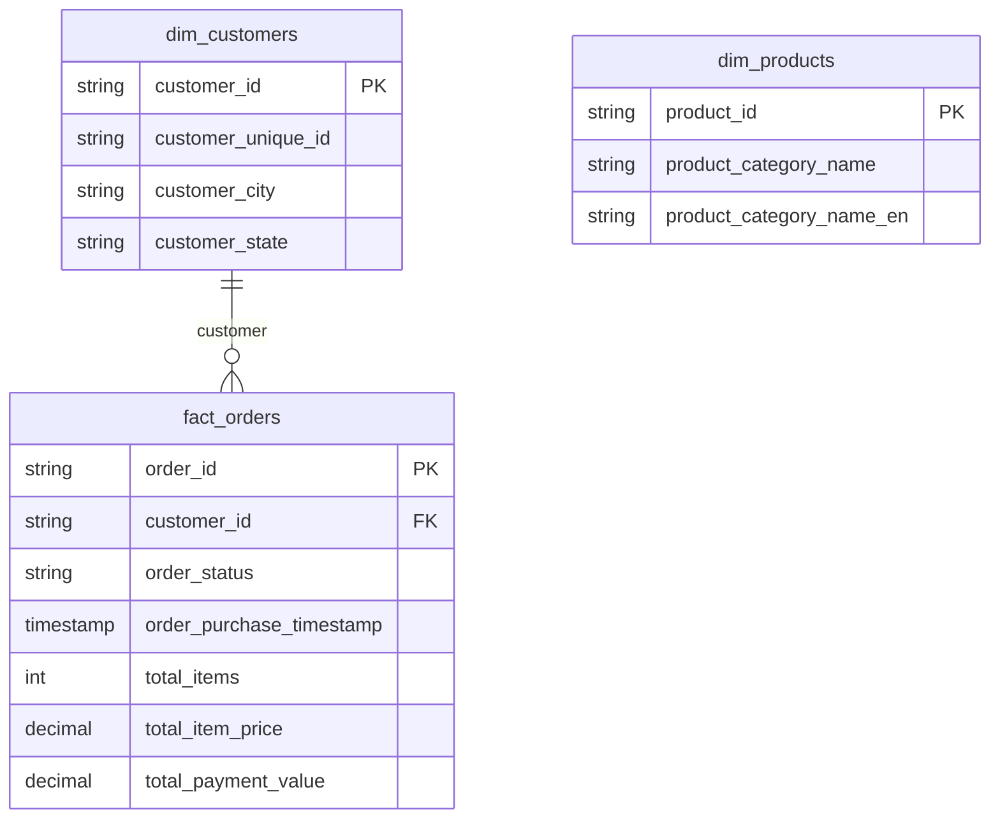
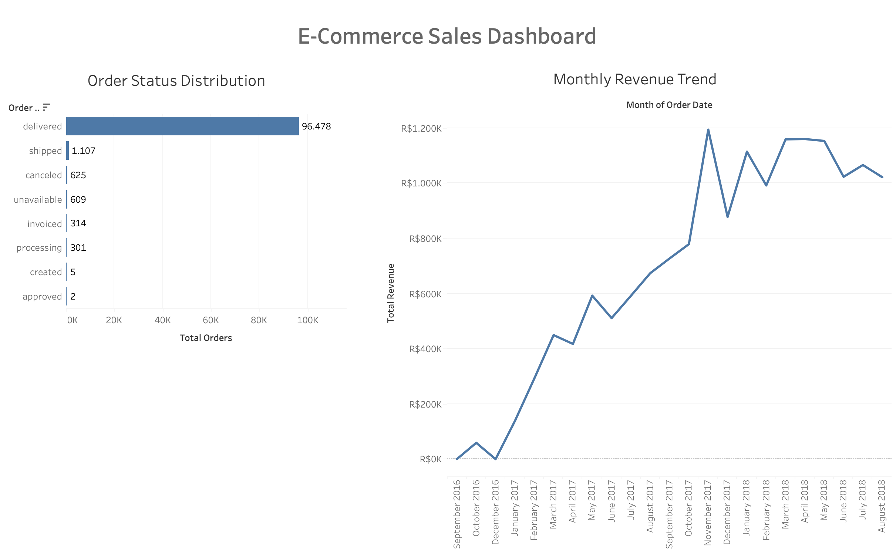

## E-Commerce Data Analysis (SQL End-to-End Project)


## Overview

This project is a portfolio-based SQL analytics project built using the Brazilian Olist E-Commerce Dataset.

The objective of this project is to simulate a real-world end-to-end analytics engineering workflow, starting from raw CSV data ingestion, data validation, dimensional modeling, fact table construction, and analytical metric generation using PostgreSQL.

The project demonstrates practical SQL skills commonly used in data analyst and analytics engineering roles, including:

- Data cleaning
- Data validation
- Dimensional modeling
- Aggregation logic
- Fact table design
- Business metric analysis
- Query optimization mindset

The final output is a structured analytical model (star schema) designed for dashboard integration with BI tools such as Power BI, Tableau, or Looker Studio.

---


## Tech Stack

- PostgreSQL
- SQL (Data Cleaning, Aggregation, Modeling)
- DBeaver
- GitHub

---


## Project Structure

```
ecommerce-sql-analysis/

  assets/
    dashboard_preview.png

  dataset/
    category_translation.csv
    customer.csv
    order_items.csv
    orders.csv
    payments.csv
    products.csv
    sellers.csv

  sql/
    01_import.sql
    02_staging_validation.sql
    03_cleaning_dimensions.sql
    04_fact_modeling.sql
    05_analysis_metrics.sql

  README.md
```

---

## Data Pipeline

1. Import raw CSV data into staging schema
2. Validate data quality (NULL checks, duplicates, row counts)
3. Clean and standardize data
4. Build dimension tables
5. Aggregate transactional data
6. Build fact table at the order level
7. Generate analytical business metrics
8. Connect the final model to BI tools

## Data Architecture

Staging Layer (staging schema)

Raw transactional data imported without transformation.

Tables:

* customers_raw
* orders_raw
* order_items_raw
* payments_raw
* products_raw
* category_translation_raw

Purpose:

* Store raw imported data
* Perform validation before transformation
* Preserve original dataset integrity

---

Warehouse Layer (public schema)

Cleaned and modeled analytical tables.

Tables:

* dim_customers
* dim_products
* fact_orders

Purpose:

* Provide business-ready analytical tables
* Support dashboarding and reporting
* Enable scalable SQL analysis

---

## Data Model (Star Schema)

This project uses a simplified star schema design.

Fact Table

* fact_orders
    * One row represents one order

Dimension Tables

* dim_customers
* dim_products

Modeling Principle

The fact table is intentionally built at the order level using pre-aggregated transactional data.

This prevents double counting issues commonly caused by joining multiple transactional tables directly.

Note:
dim_products is prepared for future product-level analysis but is not directly joined to fact_orders because the current model focuses on order-level aggregation.

---

## Entity Relationship Diagram (ERD)



---

## Data Pipeline Flow


---

## Dashboard Preview



---

## SQL Pipeline (Execution Order)

1. Import raw CSV data
2. Clean staging tables
3. Build dimension tables
4. Create fact table
5. Generate business metrics
6. Visualize in Tableau

---

## Data Validation

Validation results:

* No NULL order_id
* No duplicate order_id
* Final fact table row count matches expected order count

```
SELECT COUNT(*) 
FROM public.fact_orders;

-- Result: 99,441 rows
```

Key Insights
 * More than 95% of orders were successfully delivered.
 * Revenue growth accelerated significantly during 2017.
 * Peak sales performance occurred between Q4 2017 and Q2 2018.
 * Operational issues such as cancellations and unavailable products remained minimal.
 * Order fulfillment consistency indicates strong marketplace operational stability.

---

## Key Learnings

* Data validation is critical before transformation
* Aggregation should occur before joining transactional tables
* Improper joins can create double counting issues
* Star schema design improves analytical scalability
* SQL can be used to build complete analytical pipelines

---

## Author

Ahmad Iqbal Maulana — Data Analyst

LinkedIn:  
https://www.linkedin.com/in/ahmad-iqbal-maulana-9669b8228

GitHub:  
https://github.com/yourvaiqbal

---

## Notes

Dataset: Brazilian E-Commerce Public Dataset by Olist  
Source: https://www.kaggle.com/datasets/olistbr/brazilian-ecommerce

---
